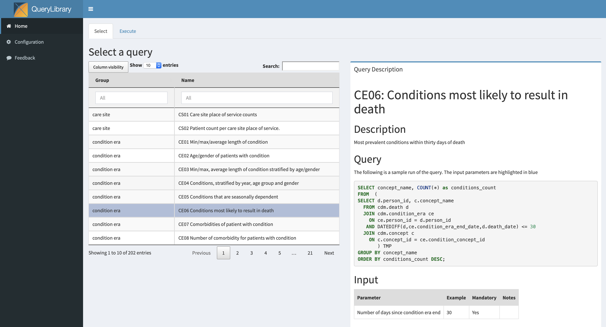

*Do not use. This package is under development*

QueryLibrary
=========

Introduction
============
This is an R package that implements a library of standard queries that run against the OMOP-CDM.
The purpose of the library is to help new users to learn how to query the CDM. The queries in the library have been approved by the OHDSI community. The query library will be mainly used for training purposes, but will also be a valuable resource for the experienced users.



Features
========
- Automatically renders the queries to the dialect, cdm and vocabulary schemas as specified by the user
- Can execute the query against a user's database
- Allows saving and loading user settings

Technology
============
QueryLibrary is an R package that uses Shiny and Markdown. The tool automatically reads and renders sql from Markdown files in its queries folder.
The query file contains a description of the query, and explains the input variables and results table. The following information is parsed from the markdown files using tags:

* Group. Allows to group queries, e.g. by domain
* Name. The name of the query in the search table.
* CDM-Version. The version this query runs on, e.g. >5.0
* Author. The person responsible for writing the query
* Query. The query is taken from the .Md file, rendered using SqlRender and is shown to the user in its preferred dialect.

The execution functionality has been made optional, so this can be switched off when installed on a public server. This can be done in the global.R with the following parameter: allow_execute = FALSE

System Requirements
===================
Running the package requires R with the package rJava installed. Also requires Java 1.6 or higher.

Dependencies
============
 * SQLRender
 * DatabaseConnector
 * Shiny

Getting Started
===============
## Installation
  
To install the latest development version, install from GitHub:

```r
install.packages("devtools")
devtools::install_github("ohdsi/QueryLibrary")
```

Once installed, you can try out the Shiny app that comes with the package:

```r
library(QueryLibrary)
launchQueryLibrary()
```

## Setting the configuration

The configuration section allows the user to set the dialect and other connectionDetails for the CDM. This settings file can be saved and loaded using the buttons on the top of the page. 

## Selecting and running a query

Using the library table the user can select a query. The markdown file of the query can be see on the right. The Execute tab allows the user to import the selected query, edit the query (the window can be made bigger if needed), run, copy, and save the query. The tool will show a counter when the query is runninng and will show the results table below the query.

Getting Involved
=============

We would like to increase the number of queries in the library and like the community to drive this. If there are suggestions please post them in the issue tracker or even better do a pull request and we will review and approve your query.

Note that if you add queries you have to follow the [OHDSI code style for SQL](https://www.ohdsi.org/web/wiki/doku.php?id=development:ohdsi_code_style_for_sql).

* Vignette: [Using QueryLibrary](https://github.com/OHDSI/QueryLibrary/blob/master/inst/doc/UsingQueryLibrary.pdf)
* Package manual: [QueryLibrary manual](https://github.com/OHDSI/QueryLibrary/blob/master/extras/QueryLibrary.pdf) 
* Developer questions/comments/feedback: <a href="http://forums.ohdsi.org/c/developers">OHDSI Forum</a>
* We use the <a href="../../issues">GitHub issue tracker</a> for all bugs/issues/enhancements

License
=======
QueryLibrary is licensed under Apache License 2.0

Development
===========
QueryLibrary is being developed in R Studio.

### Development status

[](https://travis-ci.org/OHDSI/QueryLibrary)

Funding
=======
This work was performed within the European Health Data & Evidence Network ([EHDEN](https://www.ehden.eu)) project in collaboration with OHDSI. The European Health Data & Evidence Network has received funding from the Innovative Medicines Initiative 2 Joint Undertaking (JU) under grant agreement No 806968. The JU receives support from the European Union’s Horizon 2020 research and innovation programme and EFPIA.


